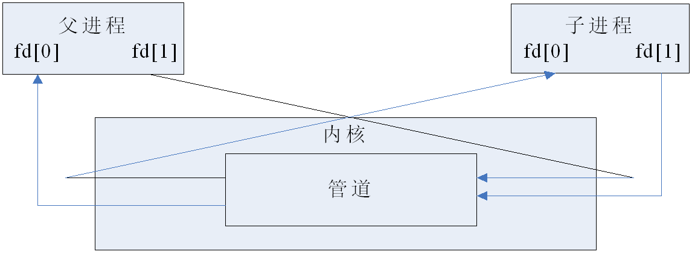
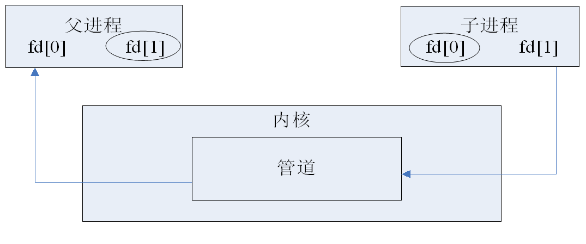
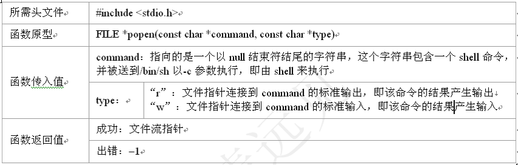
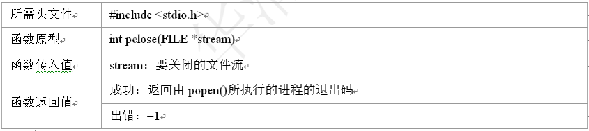
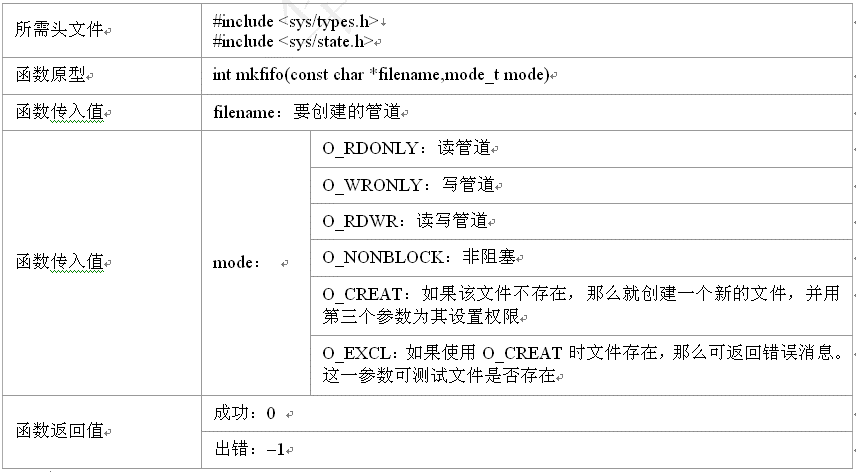

    <h1>
        管道（Pipe）    
    </h1>

<h2> Pipe概述 </h2>
<ul>
    <h3>管道是Linux中进程间通信的一种方式，它分为三种：无名管道，标准流管道，有名管道。</h3>
    <li><h3>1-无名管道：只能用于具有亲缘关系的进程之间的通信（也就是父子进程或者兄弟进程）</h3></li>
        <ul>
            <h3><概述></h3>
            <h4>
                <li>它是一个半双工的通信模式，具有固定的读端和写端。</li>
                <li>它可以看做一中特殊的文件，对它的读写可以使用read()和write()等函数，但是它不属于普通的文件，并不属于其他任何的文件系统，并且只存在与内核空间中</li>
            </h4>
            <h3><无名管道的创建和关闭></h3>
            <h4>
                <创建管道>
                <li>管道是机遇文件描述符的通信方式，当一个管道建立时，它会创建两个文件描述符fds[0]和fds[1]，其中fds[0]固定用于读管道，而fds[1]固定用于写管道，这样就构成一个半双工的通道</li>
                <li>创建管道的函数：</li>
                

                    
                

                <关闭管道>
                <li>管道关闭时只需要使用close()函数逐个关闭各个文件描述符。</li>
            </h4>
            <h3><父子进程间的无名管道通信></h3>
            <h4>
                <li>用pipe()函数创建的管道两端处于一个进程中，由于管道主要用于不同进程间的通信，因此实际应用中没有太大意义。实际上，通常先是创建一个管道，再通过fork()函数创建一子进程，该子进程会继承父进程的所创建的管道</li>
                

                    
                

                <li>父子进程分别拥有自己的读写通道，为了实现父子进程之间的读写，只需把无关的读端或写端的文件描述符关闭即可，此时，父子进程之间就建立起了一条“子进程写入，父进程读取”的通道</li>
                

                    
                

            </h4>
        </ul>
    <li><h3>2-标准流管道</h3></li>
        <ul>
            <h3><概述></h3>
            <h4>
                <li>基于文件流的管道主要是用来创建一个连接到另外一个进程的管道，这里的“另外一个进程”也就是一个可以进行一定操作的可执行文件，例如，用户执行“ls -l”或者自己编写的程序“./pipe”等，由于这一类操作很常有，因此标准流管道就将一系列的创建过程合并到一个函数popen()完成</li>
            <h3><标准流管道的创建和关闭></h3>
                <创建管道>
                <li>标准流管道的使用可以大大减少代码的编写量，但同时也有一些不利之处，例如:他不如前面无名管道创建的函数那样灵活多样，并且用popen()创建的管道必须使用标准I/O函数进行操作，但不能使用前面的read()和write()一类不带缓冲的I/O函数</li>
                

                    
                

                <关闭管道>
                <li>与之相对应，用popen()函数创建的流管道必须使用函数pclose()来关闭流管道，该函数关闭标准I/O流，并将等待命令执行完毕</li>
                

                    
                

            </h4>
        </ul>
    <li><h3>3-有名管道：突破了前面两种只能用于亲缘关系的进程之间的关系。它可以使互不相关的两个进程彼此通信，</h3></li>
        <ul>
            <h3><概述></h3>
            <li>FIFO是严格的遵循先进先出规则，对管道及FIFO的读总是从开始处返回数据，对他们的写则把数据添加到末尾，他们不支持如lseek()等文件定位操作</li>
            <li>有名管道的穿件可以使用函数mkfifo(),该函数类似文件中的open()操作，可以指定管道的路径和打开的模式</li>
            <li>创建管道成功之后，就可以使用open()、read()和write()，这些函数了。与普通文件的开发设置一样，对于为读而打开的管道可在open()中设置O_RDONLY，对于为写而打开的管道可在open()中设置O_WRONLY,在这里与普通文件不同的是阻塞问题</li>
            <li>由于普通文件的读写是不会出现阻塞问题，而在管道的读写中且有阻塞问题的可能，这里的非阻塞标志可以在open()函数中设定为O_NONBLOCK</li>
            <li><h3>对于读进程</h3></li>
                <ul>
                    <li>若管道是阻塞打开，且当前FIFO内没有数据，则对读进程而言将一直阻塞到有数据写入</li>
                    <li>若管道是非阻塞打开，则不论FIFO内是否有数据，读进程都会立即执行读操作，即如果FIFO内没有数据，则读函数将立即返回0</li>
                </ul>
            <li><h3>对于写进程</h3></li>
                <ul>
                    <li>若管道是阻塞打开，则写操作将一直阻塞到数据可以被写入</li>
                    <li>若管道是非阻塞打开而不能写入全部数据，则读操作进行部分写入或者调用失败</li>
                </ul>
            <h3><有名管道的创建></h3>
                

                    
                

        </ul>
</ul>
