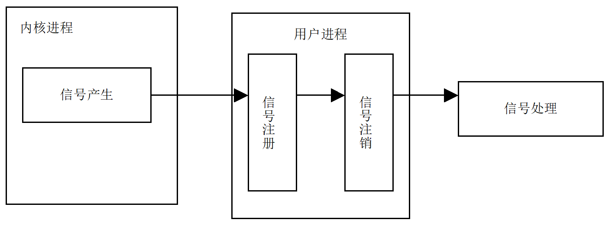
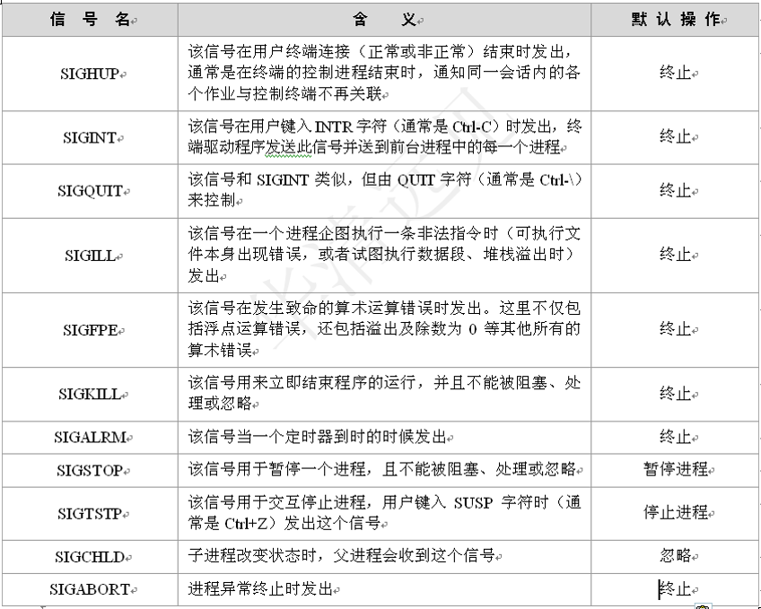
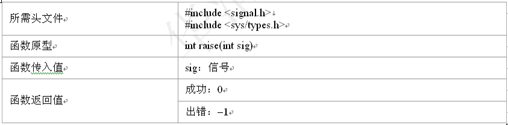
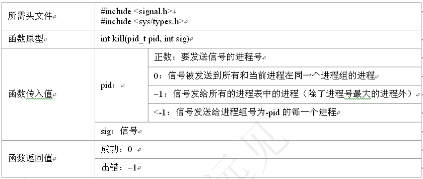
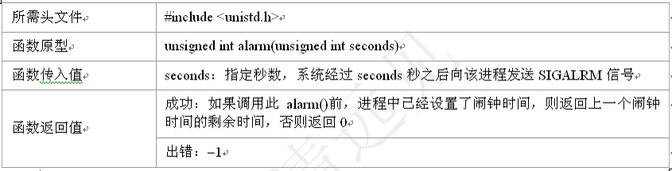
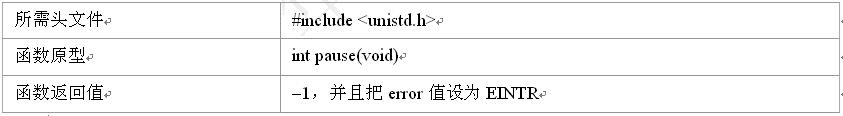
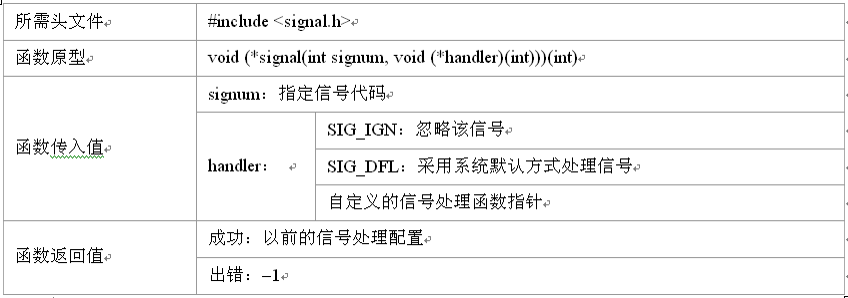
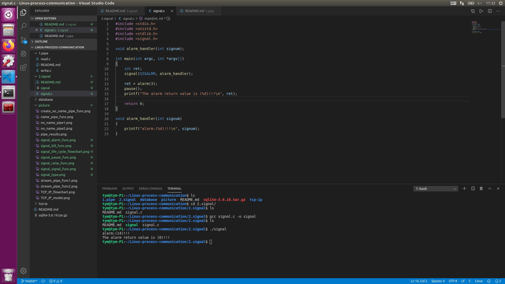

    <h1>
        《信号（Signal)》
    </h1>

<h2> Signal概述 </h2>
<ul>
    <h3>信号是UNIX中所使用的进程通信的一种最古老的方法，它在软件层次上对中断机制的一种模拟，是一种异步通信方式。信号可以直接进行用户空间进程和内核进程之间的交互，内核进程也可以利用他来通知用户空间进程发生了哪些系统时间。它可以在任何时候发给某一进程，而无需知道该进程的状态。如果该进程当前并未处于执行态，则该信号就由内核保存起来，直到该进程回复执行在传递给它为止。</h3>
    <h3>
        <li><信号的生命周期></li>
        一个完整的信号可以分为3个重要阶段，这个阶段由四个重要事件组成：信号的产生，信号在进程中注册，信号在进程中注销，执行信号处理函数。
        

            
        

        <li>注意：系统有64个信号，前32个是不可靠信号，后32和是可靠信号</li>
        <li>用户进程对信号的响应的方式：</li>
            <ul>
                <li>忽略信号：即对信号不做任何处理，但是有两个信号不能忽略，即SIGKILL及SIGSTOP</li>
                <li>捕捉信号：定义信号处理函数，当信号发生时，执行相应的自定义处理函数</li>
                <li>执行缺省操作：Linux对每种信号都规定了默认操作</li>
            </ul>
    </h3>
</ul>

<h2>信号类型</h2>

    

<h2>信号相关函数</h2>
<ul>
    <h3>
        <li>raise()函数：允许进程向自己发送信号</li>
            

                
            

        <li>kill()函数：可以发送信号给进程或进程组，它不仅可以中止进程，也可以向进程发送其他信号</li>
            

                
            

        <li>alarm()函数：闹钟函数，它可以在进程中设置一个定时器，当定时器指定的时间到时，它就向进程发送SIGALARM信号。其中，一个进程只能有一个闹钟时间，如果在调用alarm()之前已设置过闹钟时间，则任何以前的闹钟时间都被新值所代替</li>
            

                
            

        <li>pause()函数：用来将调用进程挂起直至捕捉到信号为止。这个函数主要用于判断信号是否已到</li>
            

                
            

        <li>signal()函数：信号处理</li>
            

                
            

    </h3>
</ul>

<h2> 例程 </h2>
<ul>
    <h3>信号例程请参考当前文件夹的signal.c</h3>
    <h3><运行结果></h3>
    

        
    

</ul>