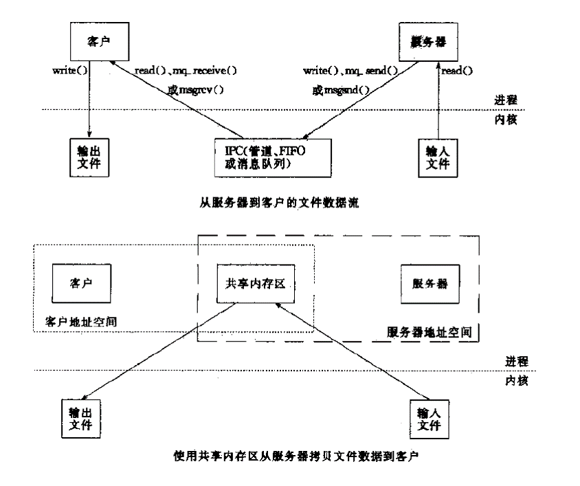
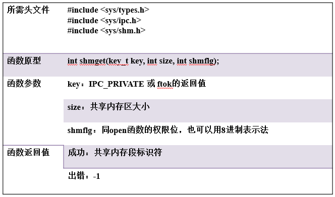
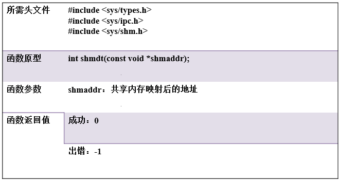

    <h1>
        《共享内存（Shared memory)》
    </h1>

<h2>Shared memory概述 </h2>
<ul>
    <h3>共享内存：是一种最为高效的进程间通信方式，进程可以直接读写内存，而不需要任何数据的拷贝。</h3>
    <h4>
        <li>为了在多个进程交换信息，内核专门留出一块内存区，可以由需要访问的进程将其映射到自己的私有地址空间，进程就可以直接读取这一内存而不需要进行数据的拷贝，从而大大提高了效率</li>
        <li>由于多个进程共享一段内存，因此也需要依靠某种同步机制，如互斥锁和信号量等</li>
    </h4>
    <h3>共享内存的特点</h3>
    <h4>
        <li>共享内存和其他进程通信方式对比图，进程直接读取内存区。</li>
        

            
        

    </h4>
    <h3>共享内存的实现步骤</h3>
    <h4>
        <li>创建/打开共享内存</li>
        <li>映射共享内存，即把指定的共享内存映射到进程的地址空间用于访问</li>
        <li>撤销共享内存映射</li>
        <li>删除共享内存对象</li>
    </h4>
</ul>

<h2>共享内存相关函数</h2>
<ul>
    <h3>
        <li>shmget()函数：创建共享内存</li>
            

                
            

            <ul>
                key_y:是由函数ftok()返回。
                <li>ftok()函数原型：key_t ftok(char *fname, int id)</li>
                <ul>
                    <li>fname:指定的文件名（该文件必须存在而且可以访问）</li>
                    <li>id:子序号，虽然为int，但是只有8个比特被使用（0-255）</li>
                    <li>当成功执行的时候，一个key_t值将会被返回，否则-1被返回</li>
                </ul>
            </ul>
        <li>shmat()函数：内存映射，并获的映射地址</li>
            

                
            

        <li>shmdt()函数：断开共享内存连接</li>
            

                
            

        <li>shmctl()函数：共享内存管理</li>
            

                
            

    </h3>
</ul>