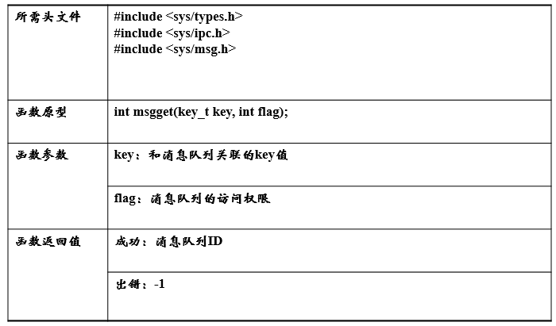

    <h1>
        《消息队列（Message queue)》
    </h1>

<h2>Message queue概述 </h2>
<ul>
    <h3>多个独立的进程之间可以通过消息缓冲机制来相互通信，这种通信的实现是以消息缓冲区为中间介质，通信双方的发送和接收操作均以消息为单位。<h3>
    <h3>消息队列一旦创建后即可由多进程共享，发送消息的进程可以在任意时刻发送任意个消息到制定的消息队列上，并检查是否有接收进程在等待它所发送的消息，若有则唤醒它。而接收信息的进程可以在需要消息的时候到制定的消息队列上获取消息，如果消息还没有到来，则转为睡眠状态等待<h3>
    <ul>
        <h4>
            <li>消息队列是IPC对象的一种</li>
            <li>消息队列有消息队列ID来唯一标识</li>
            <li>消息队列就是一个消息的列别。用户可以在消息队列中添加消息、读取消息</li>
            <li>消息队列可以按照类型来发送/接受消息</li>
        </h4>
    </ul>
    <h3>消息队列的操作</h3>
    <ul>
        <h4>
            <li>创建消息队列</li>
            <li>添加消息</li>
            <li>读取消息</li>
            <li>控制消息队列</li>
        </h4>
    </ul>
    <h3>消息队列的优点</h3>
    <ul>
        <h4>
            <li>允许任意进程通过共享消息队列来实现进程间通信</li>
            <li>由系统调用函数来实现消息发送和接收之间的同步，使得用户在使用消息缓冲进行通信时不再需要考虑同步问题。</li>
        </h4>
    </ul>
    <h3>消息队列的缺点</h3>
    <ul>
        <h4>
            <li>信息的复制需要额外消耗CPU的时间，不适宜于信息量大或操作频繁的场合</li>
        </h4>
    </ul>
</ul>

<h2>消息队列相关函数</h2>
<ul>
    <h3>
        <li>msgget()函数：创建或打开消息队列，这里穿件的消息队列的数量会受到系统消息队列数量的限制</li>
            

                
            

        <li>msgsnd()函数：发送消息，按照类型把消息添加到已打开的消息队列末尾</li>
            

                
            

        <li>msgrcv()函数：读取消息，按照类型把消息从消息队列中取走</li>
            

                
            

        <li>msgctl()函数：控制消息队列</li>
            

                
            

    </h3>
</ul>
<h2> 例程 </h2>
<ul>
    <h3>消息队列例程请参考当前文件夹的server.c和client.c</h3>
    <h3><运行结果></h3>
    

        
    

</ul>