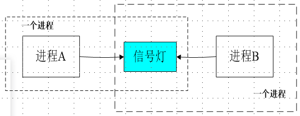
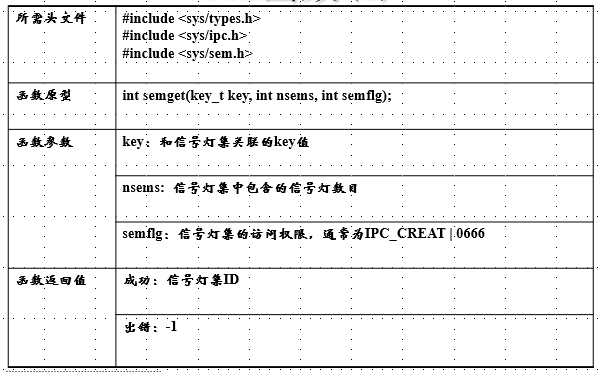
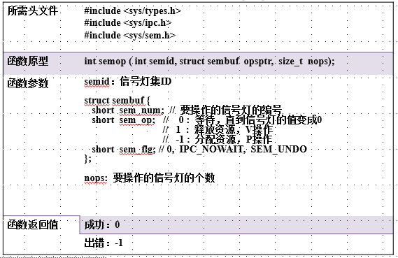
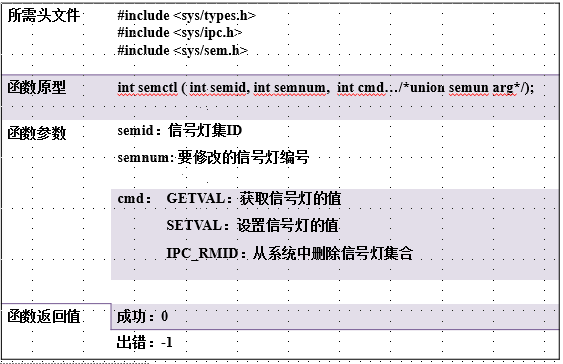
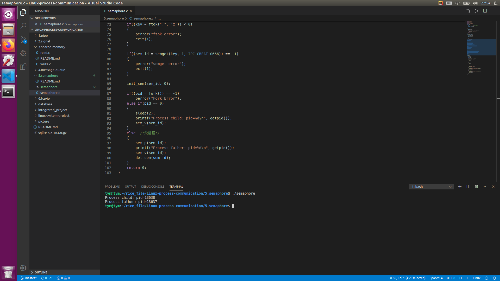

    <h1>
        《信号量（Semaphore)》
    </h1>

<h2>Message queue概述 </h2>
<ul>
    <h3>信号量：它是不同进程或者一个给定进程内部不同线程间同步的机制</h3>
    <h4>
        <li>二值信号量：值为0或者1，与互斥锁类似，资源可用时，值为1，不可用时，值为0</li>
        <li>计数信号灯：值在0到n之间。用来统计资源，其值代表可用资源数</li>
        <li>等待操作:等待信号灯的值变为大于0，然后将其减1；而释放操作则相反，用来唤醒等待资源的进程或者线程</li>
    </h4>
    <h3>System V 信号灯（进程同步）:是一个或者多个信号灯的一个集合。其中的每一个都是单独的计数信号灯。而Posix信号灯（线程同步）指的是单个计数信号灯</h3>
    <h4>
        <li>System V 信号灯由内核维护</li>
        

                
        

    </h4>
    <h3>信号量的使用规则</h3>
    <h4>
        <li>若信号量为正，则进程可使用该资源</li>
        <li>若信号量为0，则进程阻塞等待，并将进程插入等待队列，直到该信号量的值大于0从等待队列中执行进程请求</li>
        <li>加锁操作：如果信号量大于0,则信号量-1;如果信号量为0,则挂起该进程，并将这个进程插入等待队列</li>
        <li>解锁操作：如果等待队列中有进程则唤醒该进程，让它恢复运行，否则，信号量+1</li>
    </h4>
</ul>

<h2>信号量相关函数</h2>
<ul>
    <h3>
        <li>semget()函数：创建新的信号量或取得已有的信号量</li>
            

                
            

        <li>semop()函数：改变信号量的值，改变操作在sem_opa中，sem_opa是sumbuf结构体对象</li>
            

                
            

        <li>semctl()函数:控制信号量</li>
            

                
            

    </h3>
</ul>

h2> 例程 </h2>
<ul>
    <h3>信号量例程请参考当前文件夹的semaphore.c</h3>
    <h3><运行结果></h3>
    

        
    

</ul>
    