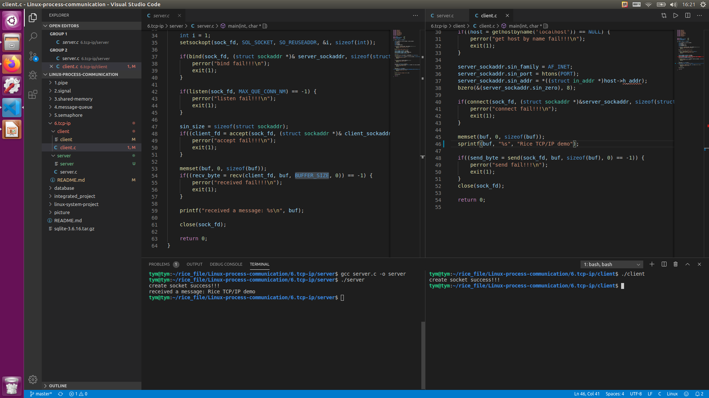

    <h1> 
        《TCP/IP 网络编程》
    </h1>

<h2>TCP/IP 模型 </h2>

    

<h2>TCP/IP 三次握手</h2>
<h4>
    <ul>
    <服务器与客户端建立连接>
    <li>第一次握手：建立连接时，客户端向服务器发送第一个SYN包，并进入SYN_SENT状态，等待服务器确认</li>
    <li>第二次握手：当服务器收到客户端的请求后，此时要给客户端一个确认信号ACK，同时发送SYN包，此时服务器进入SYN_RECV状态</li>
    <li>第三次握手：客户端收到服务器的发的ACK+SYN包，向服务器发送ACK，发送完毕之后，客户端和服务器进入ESTABLISHED（TCP连接成功）状态，完成三次握手</li>
    </ul>
</h4>

<h2>TCP/IP 四次挥手 </h2>
<h4>
    <ul>
     <服务器与客户端断开连接>
    <li>第一次挥手：客户端发送一个FIN后，用来关闭客户端到服务器的数据传输，客户端进入FIN_WAIT_1状态</li>
    <li>第二次挥手：服务器收到FIN后，发送一个ACK给客户端，确认序号为收到序号+1（与SUN相同，一个FIN占用一个序号），服务器进入CLOSE_WAIT状态</li>
    <li>第三次挥手：服务器发送一个FIN，用来关闭服务器到客户端的数据传输，服务器进入LAST_ACK状态</li>
    <li>第四次挥手：客户端收到FIN后，客户端进入TIME_WAIT状态，接着发送一个ACK给服务器，确认序号为收到序号+1，度武器进入CLOSED状态，完成四次挥手</li>
    </ul>
</h4>

<h2>TCP/IP 流程图</h2>
    

        
    

<h2>服务端与客户端</h2>
<h4>
    <li>服务端：提供服务的一端，它始终等待别人的服务请求，只有“别人主动找它联系，而永远不会主动找别人联系”。为了让别人能够找到它，它必须公开其socket属性：协议-ip地址-端口号</li>
    <li>客户端：请求服务的一端，主动联系别人的一方，因为它不需要别人找它，所以无需公开其socket属性</li>
</h4>

<h2>socket类型</h2>
<h4>
    <ul>
    <li>流式socket（SOCK_STREAM）：流式套接字提供可靠的、面向连接的通信流；它使用TCP协议，从而保证了数据传输的正确性和顺序性。</li>
    <li>数据报socket（SOCK_DGRAM）：数据报套接字定义了一种无连接的服务，数据通过相互独立的报文进行传输，是无序的，并且不保证是可靠、无差错的。它使用数据报协议UDP。</li>
    <li>原始socket：原始套接字允许对底层协议如IP或ICMP进行直接访问，它功能强大但使用较为不便，主要用于一些协议的开发。</li>
    </ul>
</h4>

<h2>TCP/IP 相关函数</h2>
<ul>
    <h3>
        <li>socket()函数：该函数用于建立一个socket连接（即创建一个套接字），可指定socket类型等信息。在建立了socket连接之后，可对sockaddr或sockaddr_in结构进行初始化，以保存所建立的socket地址信息。</li>
            

                
            

        <li>bind()函数：该函数是用于将socket套接字与本地IP地址及端口号绑定，若绑定其他IP地址则不能成功。另外，它主要用于服务器端，而在客户端则无必要。</li>
            

                
            

        <li>listen()函数：在服务端程序成功建立套接字和与地址进行绑定之后，还需要准备在该套接字上接收新的连接请求。此时调用listen()函数来创建一个等待队列，在其中存放未处理的客户端连接请求。</li>
            

                
            

        <li>accept()函数：服务端程序调用listen()函数创建等待队列之后，调用accept()函数等待并接收客户端的连接请求。它通常从由bind()所创建的等待队列中取出第一个未处理的连接请求。</li>
            

                
            

        <li>connect()函数：该函数在TCP中是用于bind()的之后的client端，用于与服务器端建立连接。</li>
            

                
            

        <li>send()和recv()：这两个函数分别用于发送和接收数据，用在TCP中。</li>
        <li> sendto()和recvfrom()：这两个函数的作用与send()和recv()函数类似，可以用在TCP和UDP中。当用在TCP时，后面的几个与地址有关参数不起作用，函数作用等同于send()和recv()；主要用在UDP时，这两个函数可以自动寻找指定地址并进行连接。</li>
            

                
            

            

                
            

    </h3>
</ul>

<h2> 例程 </h2>
<ul>
    <h3>TCP/IP例程请参考当前文件夹的server.c和client.c</h3>
    <h3><运行结果></h3>
    

        
    

</ul>