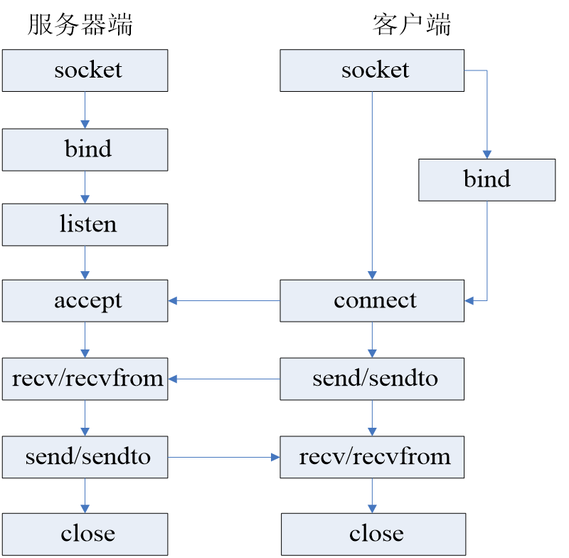

    <h1> 
        《TCP/IP 网络编程》
    </h1>

<h2> 1.TCP/IP 模型 </h2>

    

<h2> 2.TCP/IP 三次握手</h2>
<h4>
    <ul>
    <服务器与客户端建立连接>
    <li>第一次握手：建立连接时，客户端向服务器发送第一个SYN包，并进入SYN_SENT状态，等待服务器确认</li>
    <li>第二次握手：当服务器收到客户端的请求后，此时要给客户端一个确认信号ACK，同时发送SYN包，此时服务器进入SYN_RECV状态</li>
    <li>第三次握手：客户端收到服务器的发的ACK+SYN包，向服务器发送ACK，发送完毕之后，客户端和服务器进入ESTABLISHED（TCP连接成功）状态，完成三次握手</li>
    </ul>
</h4>

<h2> 3.TCP/IP 四次挥手 </h2>
<h4>
    <ul>
     <服务器与客户端断开连接>
    <li>第一次挥手：客户端发送一个FIN后，用来关闭客户端到服务器的数据传输，客户端进入FIN_WAIT_1状态</li>
    <li>第二次挥手：服务器收到FIN后，发送一个ACK给客户端，确认序号为收到序号+1（与SUN相同，一个FIN占用一个序号），服务器进入CLOSE_WAIT状态</li>
    <li>第三次挥手：服务器发送一个FIN，用来关闭服务器到客户端的数据传输，服务器进入LAST_ACK状态</li>
    <li>第四次挥手：客户端收到FIN后，客户端进入TIME_WAIT状态，接着发送一个ACK给服务器，确认序号为收到序号+1，度武器进入CLOSED状态，完成四次挥手</li>
    </ul>
</h4>

<h2>4. TCP/IP 流程图</h2>

    

<h2>5. socket类型</h2>
<h4>
    <ul>
    <li>流式socket（SOCK_STREAM）：流式套接字提供可靠的、面向连接的通信流；它使用TCP协议，从而保证了数据传输的正确性和顺序性。</li>
    <li>数据报socket（SOCK_DGRAM）：数据报套接字定义了一种无连接的服务，数据通过相互独立的报文进行传输，是无序的，并且不保证是可靠、无差错的。它使用数据报协议UDP。</li>
    <li>原始socket：原始套接字允许对底层协议如IP或ICMP进行直接访问，它功能强大但使用较为不便，主要用于一些协议的开发。</li>
    </ul>
</h4>